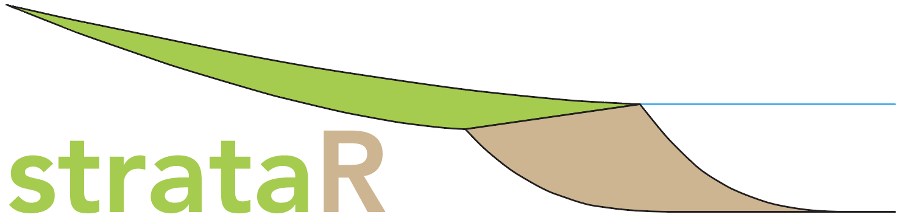
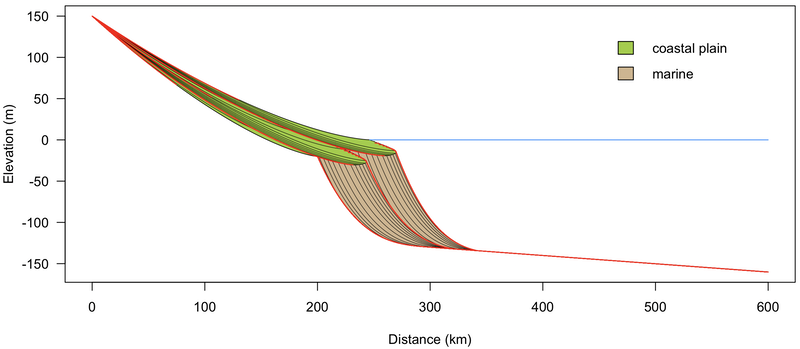

# strataR

An R package for simulating the nonmarine stratigraphic and fossil record

## Installation

You can install the dev version of strataR from Github with: 

``` r
devtools::install_github("hms-github/strataR", build_vignettes=TRUE)
```

Building the vignettes will take a few minutes. I recommend installing strataR through RStudio rather than R.app, as the latter approach has failed in some cases. The problem is that pandoc is needed to generate the vignettes, but it may not be installed or R.app does not have the path to pandoc. RStudio automatically handles these issues. Alternatively, you can run the following in R.app, but it will not generate the vignettes.

``` r
devtools::install_github("hms-github/strataR")
```

## Instructions

Read the Introduction to strataR vignette for how to get started making your basins and their fossil record. The two vignettes for strataR can be opened like this:

``` r
vignette("introduction", "strataR")
vignette("examples", "strataR")
```

Nearly all basin simulation models are complex, even a relatively simple one like strataR. It is a recipe for disappointment to begin by entering values to see what will happen; most likely, such a model will fail. 

A much more successful strategy is to start by running an existing basin simulation, such as those demonstrated in the introduction and examples vignettes. Modify one variable at a time by a relatively small amount to get a sense of how sensitive the simulation is to that variable. Continue by modifying other variables until you get the simulation you are after.

Here's a very simple basin simulation as another starting point. This will create a 3.0 million year simulation of a passive margin with constant subsidence rates, constant sediment flux, and two 1.5 million year eustatic cycles with a 15 m (30 m peak-to-peak) amplitude. The basin is plotted with time lines every 0.1 million years (in black), with hiatuses shown in red.

``` r
library(strataR)

geom <- geometry(fallLineY=150, shoreX=200, deltaWidth=100, deltaToeY=-100, 
  marginWidth=600, nonMarAlpha=0.5, marineAlpha=2.0, duration=3.0, timeStep=0.01)

subs <- subsidence(geometry=geom, startingLeft=0.0, startingRight=20.0)

eust <- eustasy(geometry=geom, period=1.5, amplitude=15, phase='rising', shape=3)

sedi <- sediment(geometry=geom, startingVolume=60)

sedBasin <- basin(geometry=geom, subsidence=subs, eustasy=eust, sediment=sedi)

dev.new(height=4, width=7)
plot(sedBasin, 'valley')
addTimeLines(sedBasin, 'valley', timeLines=seq(0.1, 2.9, 0.1), lwd=0.5)
addHiatuses(sedBasin, 'valley', col='red', lwd=1.0)
```



## Support

If you have any questions, problems, or requests, please email me at stratum@uga.edu.

## Code of conduct 

The strataR project is released with a [Contributor Code of Conduct](https://github.com/hms-github/strataR/blob/main/CODE_OF_CONDUCT.md). By contributing to this project, you agree to abide by its terms.
