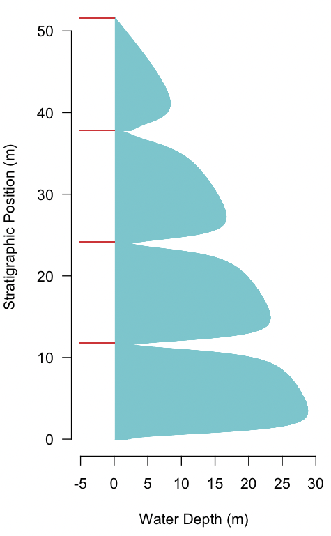
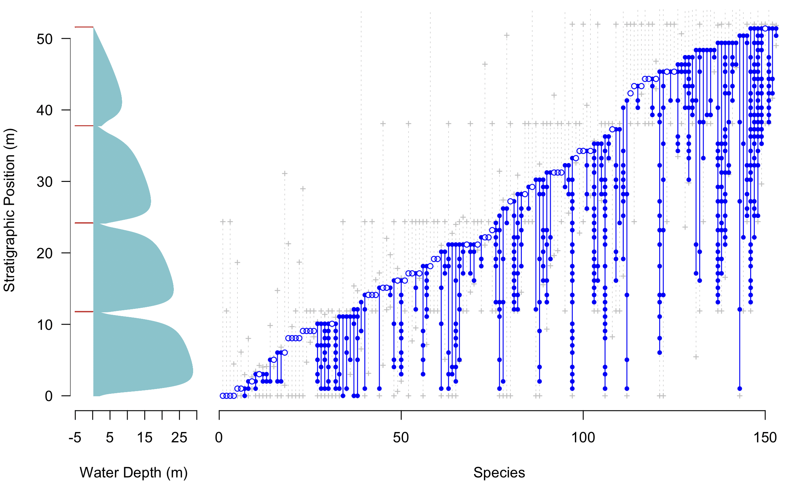
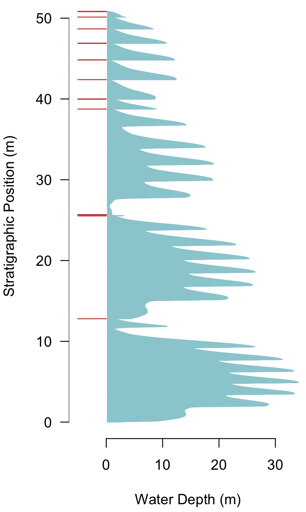

```{r, include = FALSE}
knitr::opts_chunk$set(
  collapse = TRUE,
  comment = "##>"
)
```

## Simulating Carbonate Columns and Their Fossil Record

### Overview

strataR can also simulates stratigraphic columns formed in shallow-marine carbonate environments, as well as their fossil record, based on the foundational model of Read et al. (1986). Their model, and the one in strataR, combines tectonic (driving) subsidence, eustatic sea level changes, and depth-dependent carbonate sedimentation rates, but it lacks isostatic subsidence, compaction, and erosion. Because it is a one-dimensional (vertical) model, it lacks lateral sediment transport and can simulate only stratigraphic columns, not sedimentary basins. Even so, this model captures the salient features of carbonate stratigraphy, including meter-scale cycles, their stacking patterns, and subaerial unconformities.

### Simulating Columns

A simple column is built much like other strataR models by defining geometry, subsidence, and eustasy, but using carbSediment() to establish the sedimentation parameters and using carbColumn() to simulate a column directly without an intervening basin model.

Note that many of the parameters passed to geom are unnecessary, as only the duration and timeStep arguments will be used. The geometry() function is used nonetheless to create compatibility with the rest of strataR.

Because only a column will be generated, there are two approaches to creating the subsidence object. The first is to specify the subsidence rates on the two ends of the basin, and then to specify a specific location along that profile for creating a column. Doing this lets you easily create a column somewhere else, at a location with a different subsidence rate. This is the approach shown below. The other way to approach this is to set the subsidence rate at the left and right edges of the basin to be identical, such that the location in the basin does not matter.

##### Carbonate sedimentation parameters

Carbonate sedimentation varies markedly with water depth, and several studies have described this relationship. Nearly all show highest sedimentation rates in very shallow water, corresponding to the &ldquo;carbonate factory&rdquo;, with sedimentation rates decreasing to zero at the shore and to very low rates into deeper water. In strataR, this relationship is described by specifying a series of water depths and their corresponding sedimentation rates. As the column is built, sedimentation rates between these are calculated by linear interpolation between these nodes. Each of these (water depths and sedimentation rates) are constructed as a vector.

In addition, carbonate sedimentation requires specifying a lag time, which reflects a duration of time in which sediment will not be produced (deposited) following the flooding of a carbonate platform that had been above sea level. Early modeling studies, such as Read et al. (1986), found that flooding surfaces that bound the ubiquitous meter-scale cycles of shallow marine carbonates could not be generated without this lag time or an equivalent lag depth. Typical values have been found empirically by generating modeled stratigraphy that matches the stratigraphy seen in outcrop. The sedimentological cause behind lag time or lag depth remains poorly known, but Tipper (1997) suggests that it has to do with a delay in the colonization of the newly flooded surface by carbonate-producing organisms.

Finally, simulating a column requires stating the initial water depth at the base of the column.

These four objects &mdash; water depth and sedimentation rate pairs, lag time, and initial water depth &mdash; are supplied to carbSediment(), which checks for errors and bundles them into a single object.

##### Creating the column

Generating a column through carbonate rocks is done with the carbColumn() function, which takes the geometry, subsidence, eustasy, and carbonate sedimentation objects as arguments, along with the position in the basin, measured in km from the left edge of the basin. 

```r
library(strataR)

geom <- geometry(fallLineY=150, shoreX=200, deltaWidth=100, deltaToeY=-100,
  marginWidth=500, resolution='medium', nonMarAlpha=0.5, marineAlpha=2.0, 
  duration=12.0, timeStep=0.001)

subs <- subsidence(geometry=geom, startingLeft=0.0, startingRight=20.0, 
  netChangeFactor=1.0)

eust <- eustasy(geometry=geom, period=3.0, amplitude=30, symmetry=0.5, phase='rising', 
  shape=4, netRise=0.0)

depths <- c(0.0,  2.0,  5.0, 10.0, 40.0, 100.0)    ## m
rates  <- c(0.0, 40.0, 15.0, 10.0, 5.0, 2.0)       ## m / m.y.
sedi <- carbSediment(depths, rates, lagTime=0.02, initialWaterDepth=2)
rm(depths, rates)

colu <- carbColumn(geom, subs, eust, sedi, 50.0)

```

As a column object, it can be displayed with the plot() command:

```r
dev.new(height=7, width=4)
plot(colu)
```



The blue portion tracks water depth through the columns, and the red lines indicate hiatuses, corresponding to times of subaerial exposure of the carbonate platform.

### Plotting fossil occurrences

Fossil occurrences can be added to a carbonate column just as they are for siliciclastics. See the Introduction to strataR for a detailed explanation. Adding occurrences is a three-step process, using marineSpecies() to create the species, marineOccurrences() to generate the occurrences in the column, and using marineOccurrenceColumnWaterDepthPlot() to plot the occurrences against the column.

```r
spec <- marineSpecies(timeStep=0.001, extRate=0.25, startingSpecies=100, 
  durationMy=12.0, minPD=0, maxPD=50, meanDT=10, sdDT=2, meanLogPA=log(25), 
  sdLogPA=log(5), maxPA=100)

occu <- marineOccurrences(column=colu, marineSpecies=spec, sampleSpacing=1.0)

dev.new()
marineOccurrenceColumnWaterDepthPlot(marineOccurrences=occu, column=colu, 
  marineSpecies=spec) 

```




## A more complicated eustatic history

Carbonate cyclicity commonly consists two or more orders of sea-level change, so this requires a slightly more complicated procedure. To do this, a simple eustasy object is made, then several orders of eustatic sea-level change are summed, and these are used to replace the seaLevel object inside the eustatic history

```r
library(strataR)

geom <- geometry(fallLineY=150, shoreX=200, deltaWidth=100, deltaToeY=-100, marginWidth=500, resolution='medium', nonMarAlpha=0.5, marineAlpha=2.0, duration=12.0, timeStep=0.001)

subs <- subsidence(geometry=geom, startingLeft=0.0, startingRight=20.0, netChangeFactor=1.0)

eust <- eustasy(geometry=geom, period=3.0, amplitude=30, symmetry=0.5, phase='rising', shape=4, netRise=0.0)

## Replace single-period eustatic history with dual-period eustatic history
eustasy3rd <- flexSin(eust$timeSeries$timePoint, period=3.0, amplitude=30, symmetry=0.5, shape=2, phase="rising")
eustasy5th <- flexSin(eust$timeSeries$timePoint, period=0.2, amplitude=6, symmetry=0.9, shape=0, phase="rising")
seaLevel <- eustasy3rd + eustasy5th
eust$timeSeries$seaLevel <- seaLevel
rm(eustasy3rd, eustasy5th, seaLevel)

## Carbonate sedimentation
depths <- c(0.0,  2.0,  5.0, 10.0, 40.0, 100.0)    ## m
rates  <- c(0.0, 40.0, 15.0, 10.0, 5.0, 2.0)    ## m / m.y.
sedi <- carbSediment(depths, rates, lagTime=0.02, initialWaterDepth=2)
rm(depths, rates)

colu <- carbColumn(geom, subs, eust, sedi, 50.0)

dev.new(height=7, width=4)
plot(colu)

```


### References

Read, J. F., J. P. Grotzinger, J. A. Bova, and W. F. Koerschner. 1986. Models for generation of carbonate cycles. Geology 14:107-110.

Tipper, J.C. 1997. Modeling carbonate platform sedimentation - Lag comes naturally. Geology 25:495-498.

