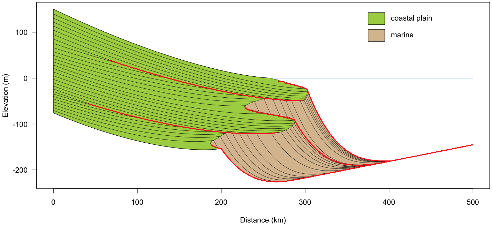

```{r, include = FALSE}
knitr::opts_chunk$set(
  collapse = TRUE,
  comment = "#>"
)
```

```{r setup}
library(strataR)
```

This vignette shows four basins and how to vary the input parameters to create different basins, as well as custom histories of subsidence, eustasy, and sediment flux.

## 1. Passive margin with sinusoidal sea level and constant sediment supply

This first basin example demonstrates the formation of depositional sequences arising from eustatic sea-level fluctuations on a passive margin. 

```{r passive, eval=FALSE}
geom <- geometry(fallLineY=150, shoreX=200, deltaWidth=100, deltaToeY=-100,
  marginWidth=500, nonMarAlpha=0.5, marineAlpha=2.0, duration=3.0, timeStep=0.01)

eust <- eustasy(geometry=geom, period=1.5, amplitude=20, phase="rising", shape=4)

subs <- subsidence(geometry=geom, startingLeft=0.0, startingRight=20.0, 
  netChangeFactor=1, period=1, amplitude=0, phase="rising", shape=0)

sedi <- sediment(geometry=geom, startingVolume=60, netIncrease=0, period=1, 
  amplitude=0, phase="rising", shape=0)

basin1 <- basin(geometry=geom, subsidence=subs, eustasy=eust, sediment=sedi)
 
dev.new()
plot(eust)

dev.new(height=6, width=12)
plot(basin1, setting="valley")
addTimeLines(basin1, setting="valley", timeLines=seq(0.1, 2.9, 0.1), lwd=0.5)
addHiatuses(basin1, setting="valley", col="red", lwd=1.5)
```

By setting `shape=4` in `eustasy()`, the sine wave of eustasy has been somewhat squared off. This will create time for the lowstand and highstand systems tracts to be developed. 


This basin has a typical passive-margin configuration where the deposits are thin near the sediment source (left) and thicken distally, reflecting increasing subsidence farther from the sediment source.

Time lines are every 0.1 m.y. in this 3.0 m.y. simulation.

Hiatal surfaces (in red) include downlap surfaces in marine areas, and erosional unconformities in nonmarine areas.


## 2. Foreland basin with sinusoidal sea level and constant sediment supply

This second example contrasts with the previous one, showing a foreland basin, which has the characteristic thickening of sediment towards the sediment source (left). Eustastic history is identical to the previous passive-margin simulation, but sediment is four times greater. If sediment was equal to the passive-margin case, the architecture would be strongly retrogradational, owing to trapping of sediment near the sediment source.

```{r foreland, eval=FALSE}
geom <- geometry(fallLineY=150, shoreX=200, deltaWidth=100, deltaToeY=-100, 
  marginWidth=500, nonMarAlpha=0.5, marineAlpha=2.0, duration=3.0, timeStep=0.01)

eust <- eustasy(geometry=geom, period=1.5, amplitude=20, phase="rising", shape=4)

subs <- subsidence(geometry=geom, startingLeft=50.0, startingRight=10.0, 
  netChangeFactor=2, period=1, amplitude=10, phase="rising", shape=0)

sedi <- sediment(geometry=geom, startingVolume=240, netIncrease=0, period=1, 
  amplitude=0, phase="rising", shape=0)

basin2 <- basin(geometry=geom, subsidence=subs, eustasy=eust, sediment=sedi)

dev.new(height=6, width=12)
plot(basin2, setting="valley")
addTimeLines(basin2, setting="valley", timeLines=seq(0.1, 2.9, 0.1), lwd=0.5)
addHiatuses(basin2, setting="valley", col="red", lwd=1.5)
```

Note the greatly thicker nonmarine record in the foreland basin. Periods of progradation and regression alternate with retrogradation and transgression. Subaerial unconformities marked by erosional truncation in this valley-based cross-section are shown in red. In marine areas, hiatal downlap surfaces in red correspond to periods of transgression and retrogradation. Note the corresponding thickening of nonmarine deposits during transgression of the shore, demonstrating landward storage of sediment during transgression.

Time lines are every 0.1 m.y. in this 3.0 m.y. simulation.



## 3. Passive margin, pulse of sea-level rise

This third example illustrates the creation of a custom sea-level history. This example simulates a single pulsed rise of sea level, which lets the effects of an abrupt rise in sea level be isolated. The approach is to create a sinuosidal eustatic history, extract the rising limb of sea level, precede and follow it by unchanging sea level, then overwrite the original eustatic history object with this custom history. This example is presented in Holland (2022), which also shows a simulation of a pulsed fall in sea level. 

The first step is to create the geometry, subsidence, and sediment objects.

```{r pulsedFallSetup, eval=FALSE}
geom <- geometry(fallLineY=150, shoreX=200, deltaWidth=100, deltaToeY=-100, 
  marginWidth=500, nonMarAlpha=0.5, marineAlpha=2.0, duration=7.5, timeStep=0.01)

subs <- subsidence(geometry=geom, startingLeft=0.0, startingRight=20.0, 
  netChangeFactor=1, period=1, amplitude=0, phase="rising", shape=0)

sedi <- sediment(geometry=geom, startingVolume=60, netIncrease=0, period=1, 
  amplitude=0, phase="rising", shape=0)
```

The eustatic history is more complex, so it is created in several steps. The first step is to create a simple sinusoidal history. Setting the shape parameter to 4 creates plateaus at the high and low points of the sine wave.

```{r pulsedFallEustasy1, eval=FALSE}
amplitude <- 25
period <- 3.0
timeStep <- 0.01
sineWave <- eustasy(geometry=geom, period=period, amplitude=amplitude, phase="rising", 
  shape=4)
seaLevel <- sineWave$timeSeries$seaLevel
timePoint <- sineWave$timeSeries$timePoint
```

Step two is to extract the rising limb from that sinusoidal sea-level curve, then precede and follow it with a period of no sea-level change.

```{r pulsedFallEustasy2, eval=FALSE}
risingLimb <- seaLevel[226:376] + amplitude
paddingSteps <- period / timeStep
preRise <- rep(0, paddingSteps)
postRise <- rep(2*amplitude, paddingSteps)
seaLevel <- c(preRise, risingLimb, postRise)
timePoint <- seq(from=0, by=0.01, length.out=length(seaLevel))
```

Step three is to overwrite the original eustasy object with the new one.

```{r pulsedFallEustasy3, eval=FALSE}
eust <- sineWave
eust$timeSeries <- data.frame(timePoint, seaLevel)
```

The eustatic history shows what was built in several steps: an initially constant sea level, a short period in which sea level rises 50 m, then a final period of unchanging sea level.

```{r pulsedFallEustasy4, eval=FALSE}
dev.new()
plot(eust$timeSeries$timePoint, eust$timeSeries$seaLevel, type="l",
  xlab="model time(m.y.)", ylab="sea level (m)", las=1)
```


Now the basin can be created.

```{r pulsedFallBasin, eval=FALSE}
dev.new()
basin3 <- basin(geometry=geom, subsidence=subs, eustasy=eust, sediment=sedi)
	
dev.new(height=6, width=12)
plot(basin3, setting="valley")
addTimeLines(basin3, setting="valley", timeLines=seq(0.2, 7.4, 0.2), lwd=0.5)
addHiatuses(basin3, setting="valley", col="red", lwd=1.5)
```

The basin shows the marked retrogradation and transgression during the sea-level rise, preceded and followed by progradation and regression. Note that the sea-level rise creates a hiatal downlap surface in marine areas (the red line in the right half of the basin), but it also triggers a hiatal surface (a subaerial unconformity) in updip areas: the red line that extends from the left edge to about 150 km into the basin.


## 4. Two-phase foreland basin

This fourth simulation mimics the two-phase foreland basin concept of Heller et al. (1988), with an early subsidence-dominated phase, followed by a basin-filling sedimentation-dominated phase. This complicated simulation requires the creation of custom subsidence and sedimentation histories. Note that in both cases, the original subsidence and sedimentation objects must be overwritten.

The geometry and eustasy objects are simple, so these are made first.

```{r twoPhaseSetup, eval=FALSE}
geom <- geometry(fallLineY=150, shoreX=200, deltaWidth=100, deltaToeY=-100, 
  marginWidth=500, nonMarAlpha=0.5, marineAlpha=2.0, duration=3.0, timeStep=0.01)
  
eust <- eustasy(geometry=geom, netRise=0.0, period=6.0, amplitude=0, phase="highPoint", 
  shape=4)
```

The subsidence history must be built in multiple steps. The first is to create a rapid step-increase in subsidence rates.

```{r twoPhaseSubsidence1, eval=FALSE}
subs <- subsidence(geometry=geom, startingLeft=50.0, startingRight=10.0, 
  netChangeFactor=1, period=6, amplitude=100, phase="lowPoint", shape=10)
```

Second, because this is at the midpoint of the simulation, copy the roughly last 75% of the simulation and use that to overwrite the first 75% of the simulation. This will shift the step-increase to be earlier: less pre-step equilibration, and more post-step equilibration.

```{r twoPhaseSubsidence2, eval=FALSE}
rates <- subs$rates
ratesTrimmed <- rates[76:301, ]
rates[1:226, ] <- ratesTrimmed
```

Third, apply a trend that will cause subsidence rates to undergo a linear decline after the step increase.
```{r twoPhaseSubsidence3, eval=FALSE}
postStepRow <- 121
trendRows <- nrow(rates) - postStepRow + 1
finalSubsMultiplier <- 0.2
trend <- seq(1.0, finalSubsMultiplier, length.out=trendRows)
constant <- rep(1, 120)
multiplier <- c(constant, trend)
# Apply the multiplier and overwrite the original rates
rates <- sweep(rates, MARGIN=1, multiplier, '*')
```

Finally, overwrite the rates in the subsidence object.
```{r twoPhaseSubsidence4, eval=FALSE}
subs$rates <- rates
```

Plotting the subsidence object shows the pattern we have created.

```{r twoPhaseSubsidence5, eval=FALSE}
dev.new()
plot(subs, geom, 'filled')
```

Subsidence rates show the pulse of subsidence (darker colors), about 0.75 m.y. after the start of the simulation. Subsidence rates peak at about 1.2 m.y, followed by decreasing subsidence rates afterwards.


Sediment history is complex, so it will also be made in multiple steps. We want to have a constant sediment flux that begins to increase when subsidence increase, but continues to increase to the end of the simulation. First, create a placeholder sediment object that will be overwritten with the complex history.

```{r twoPhaseSediment1, eval=FALSE}
sedi <- sediment(geometry=geom, startingVolume=120, netIncrease=120)
```

Second, create an initial run of constant sediment volume.

```{r twoPhaseSediment2, eval=FALSE}
initialTimeSteps <- 75
constantVolume <- 120
increaseFactor <- 8
finalVolume <- increaseFactor * constantVolume
initialVolume <- rep(constantVolume, initialTimeSteps)
```

Third, create a subsequene increase in sediment volume.

```{r twoPhaseSediment3, eval=FALSE}
numTimeSteps <- length(sedi$timeSeries$timePoint)
trendVolume <- seq(constantVolume, finalVolume, length.out=numTimeSteps-initialTimeSteps)
```

Finally, combine these two phases and overwrite the sediment object.

```{r twoPhaseSediment4, eval=FALSE}
volume <- c(initialVolume, trendVolume)
sedi$timeSeries$volume <- volume
```

Plotting the sediment object shows our custom history.

```{r twoPhaseSediment5, eval=FALSE}
dev.new()
plot(sedi)
```

Sediment supply is initially low, and abruptly begin to increase with the onset of subsidence. Sediment supply continue to increase through time, reflecting erosion of the uplifted fold and thrust belt.


Now the basin can be created.

```{r twoPhaseBasin, eval=FALSE}
basin4 <- basin(geometry=geom, subsidence=subs, eustasy=eust, sediment=sedi)

dev.new(height=5, width=12)
plot(basin4, "interfluve")
addTimeLines(basin4, "interfluve", seq(0.1, 2.9, 0.1), lwd=0.5)
addHiatuses(basin4, "interfluve", col="red", lwd=1.5)
```

The basin displays the two-phase history described by Heller et al. (1988), in which a foreland undergoes an initial phase of rapid subsidence that greatly exceeds sediment supply, and a subsequent phase in which subsidence declines while sediment flux continues to increase. The onset of subsidence is marked by strong retrogradation and transgression, with the formation of hiatal downlap surface in the marine part of the basin (red line). The second phase of the basin is marked by increasing rates of regression, accompanied by a shoreline trajectory that is initially upward, then increasingly seaward.

Time lines are every 0.1 m.y. in this 3.0 m.y. simulation.


## References

Heller, P. L., C. L. Angevine, N. S. Winslow, and C. Paola. 1988. Two-phase stratigraphic model of foreland basin sequences. Geology 16:501–504.

Holland, S. M. 2022. The structure of the nonmarine fossil record: predictions from a coupled stratigraphic-paleoecological model of a coastal basin. Paleobiology in press.

Voller, V. R., and C. Paola. 2010. Can anomalous diffusion describe depositional fluvial profiles? Journal of Geophysical Research 115:F00A13.
